# 🤖 dotclaude - Agentic Programming Flow for Claude Code

**Transform your development workflow with AI-powered automation from issue definition to implementation and review.**

dotclaude is a Claude Code configuration that enhances [Claude Code](https://claude.ai/code) with custom commands, creating a complete agentic programming flow - where AI handles the entire development lifecycle from understanding requirements to implementing solutions and addressing review feedback.

## ✨ The Agentic Programming Flow

Our three-phase workflow automates the entire development process:

```mermaid
graph LR
    A[📝 Define] --> B[🚀 Implement] --> C[✅ Review]
    A --> |"/new-gh-issue"| A1[Research codebase<br/>Understand problem<br/>Create detailed issue]
    B --> |"/start-working-on-issue"| B1[Setup environment<br/>Implement solution<br/>Run tests<br/>Create PR]
    C --> |"/review-pr-comments"| C1[Address feedback<br/>Fix issues<br/>Update PR]
```



### 1️⃣ **Define** (`/new-gh-issue`)
Claude researches your codebase, understands the problem context, and creates a comprehensive GitHub issue with implementation details.

### 2️⃣ **Implement** (`/start-working-on-issue`)
Claude automatically sets up the development environment, implements the complete solution, runs tests, and creates a pull request - all in one command.

### 3️⃣ **Review** (`/review-pr-comments`)
Claude addresses PR review comments, makes requested changes, and updates the pull request until it's ready to merge.

## 🚀 Key Features

- **Full Automation**: From issue creation to PR merge - Claude handles the entire workflow
- **Remote Execution Ready**: Designed for implementation on remote machines
- **Context-Aware**: Claude understands your codebase structure and conventions
- **Quality First**: Automatic linting, type checking, and test execution
- **Git Best Practices**: Properly formatted commits with issue references

## 📦 Installation

1. Clone this repository:
```bash
git clone https://github.com/heydiga/dotclaude.git
cd dotclaude
```

2. Copy to your Claude configuration directory:
```bash
cp -r . ~/.claude/
```

3. Restart Claude Code or reload your configuration

That's it! The custom commands are now available in your Claude Code environment.

## 🎯 Usage

### Complete Development Cycle Example

```bash
# 1. Define a new feature or bug fix
/new-gh-issue "Add dark mode support to the dashboard"

# 2. Implement the solution (Claude will handle everything)
/start-working-on-issue 123

# 3. Address review feedback
/review-pr-comments 456
```

### Available Commands

| Command | Description | What Claude Does |
|---------|-------------|------------------|
| `/new-gh-issue` | Create a GitHub issue | Researches codebase, analyzes requirements, creates detailed issue |
| `/start-working-on-issue` | Implement an issue | Sets up branch, implements solution, runs tests, creates PR |
| `/review-pr-comments` | Address PR feedback | Reviews comments, implements changes, updates PR |
| `/commit` | Create git commits | Formats commits with issue references |
| `/create-pr` | Create pull request | Runs checks, creates comprehensive PR description |
| `/fix-ci` | Fix CI/CD issues | Diagnoses and fixes pipeline failures |

## 🛠️ Configuration

### Customization

Each command is defined as a markdown file in the `commands/` directory. You can:
- Modify existing commands by editing the markdown files
- Add new commands by creating new markdown files

## 🤝 Contributing

We welcome contributions! Here's how you can help:

### How to Contribute

1. **Fork the repository**
2. **Create a feature branch** (`git checkout -b feature/amazing-command`)
3. **Make your changes**
4. **Test your changes** in Claude Code
5. **Commit your changes** (`git commit -m 'Add amazing command'`)
6. **Push to the branch** (`git push origin feature/amazing-command`)
7. **Open a Pull Request**

### Contribution Guidelines

- **Command Format**: Follow the existing markdown structure with YAML frontmatter
- **Documentation**: Update README.md if adding new commands
- **Permissions**: Only request necessary permissions in command frontmatter
- **Testing**: Test commands thoroughly before submitting
- **Code Style**: Match existing formatting and conventions

### Ideas for Contributions

- Additional workflow commands (e.g., `/deploy`, `/rollback`)
- Integration with other tools (Jira, Linear, etc.)
- Language-specific commands (Python, Go, Rust workflows)
- Team collaboration features
- Performance optimization commands

## 📄 License

This project is licensed under the MIT License - see the [LICENSE](LICENSE) file for details.

## 🙏 Acknowledgments

- Built for [Claude Code](https://claude.ai/code) by [heydiga](https://heydiga.com)
- Inspired by the need for truly autonomous development workflows
- Infinite thanks to [@flype](https://github.com/flype) for inspiration
- Thanks to all contributors and the Claude Code community

## 🔗 Links

- [Claude Code Documentation](https://docs.claude.com/en/docs/claude-code)
- [Report Issues](https://github.com/heydiga/dotclaude/issues)
- [heydiga](https://heydiga.com)

---

**Ready to revolutionize your development workflow?** Install dotclaude and let AI handle the implementation details while you focus on what matters - defining great solutions.

*Made with ❤️ by [heydiga](https://heydiga.com)*